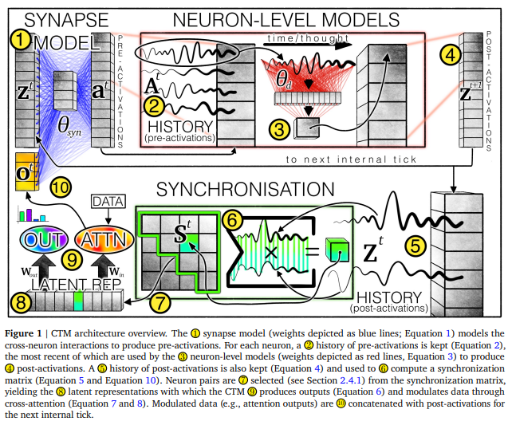

# SimpleCTM 



A super-simplified, single-file PyTorch replica of the **Continuous Thought Machine (CTM)** from Sakana AI. 

## TL;DR

Modern AI often ignores the timing and synchronization in biological brains for efficiency. CTM bridges that gap, using neural dynamics as the core of computation. This simplified version distills the essence of the [original repo](https://github.com/SakanaAI/continuous-thought-machines) into one Python file (`ctm.py`), training on MNIST to classify digits while demonstrating key CTM concepts like neuron synchronization and temporal thinking.

Inspired by the original work: [Continuous Thought Machines](https://pub.sakana.ai/ctm/) and [Sakana AI](http://sakana.ai/ctm/).

## Installation 

### Option 1: Install as a package (Recommended)

Install directly from the repository:
```bash
pip install git+https://github.com/xandykati98/SimpleCTM.git
```

Or install in editable mode for development:
```bash
git clone https://github.com/xandykati98/SimpleCTM.git
cd SimpleCTM
pip install -e .
```

### Option 2: Manual installation

1. Clone the repo:
   ```bash
   git clone https://github.com/xandykati98/SimpleCTM.git
   cd SimpleCTM
   ```

2. Install dependencies:
   ```bash
   pip install -r requirements.txt
   ```
   (Requires PyTorch, Torchvision – check `requirements.txt` for details)

## Usage 

### As a Python package

After installation, you can import and use SimpleCTM in your code:
```python
from simplectm import ctm
# Use the CTM models and utilities
```

### Running scripts directly

Run my experiments using the Modal API:
```bash
modal run simplectm/modal_experiment.py # This will run last experiment I am doing on the modal_experiment.py
modal run simplectm/modal_router.py::run_training_imagenette # Or by targeting a specific experiment on the modal_router.py

```
Run the training script:
```bash
python -m simplectm.ctm 
```

Or if running from the repository root:
```bash
python simplectm/ctm.py 
```

This will:
- Download MNIST
- Train the SimplifiedCTM model for 10 epochs
- Print progress and accuracy
- Save the model to `ctm_spatial_model`

Customize hyperparameters in `main()` – like number of neurons, max ticks, epochs.

---

For full details, dive into `ctm.py` or the original [Sakana AI CTM page](https://pub.sakana.ai/ctm/).

*Built with ❤️ by xandykati98*
